# API Test Documentation

# Create a Collection
- Open Postman.
- Click "Collections" in the sidebar.
- Click "+ New Collection".
- Name it "Momentum".
- Add variables to the collection:
    - baseUrl: http://localhost:5000/api
    - authToken: (leave empty)
    - userId: (leave empty)
    - taskId: (leave empty) 
- Click "+ Add request" to create a request.

## 01 Registration Invalid Data Request

```http
 POST {{baseUrl}}/auth/register
```

Body: 
```
{ 
    "username": "ab",
    "email": "bro@example.com",
    "password": "123"
}
```

Expected Outcome:

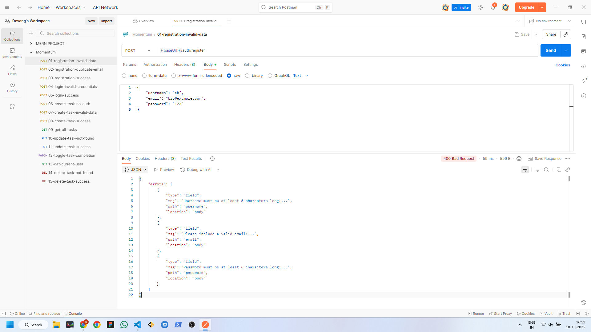

## 02 Registration Success Request

```http
 POST {{baseUrl}}/auth/register
```

Body: 
```
{
    "username": "testuser",
    "email": "test@example.com",
    "password": "password123"
}
```

Expected Outcome:

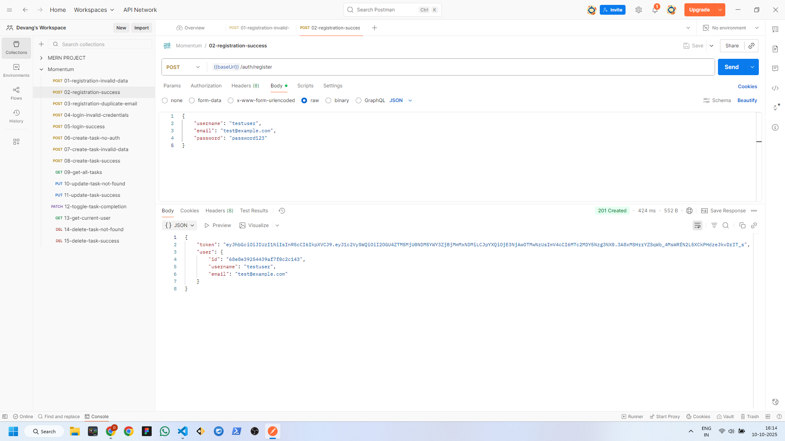

## 03 Registration Duplicate Email Request

```http
 POST {{baseUrl}}/auth/register
```

Body: 
```
{
    "username": "differentuser",
    "email": "test@example.com",
    "password": "password123"
}
```

Expected Outcome:

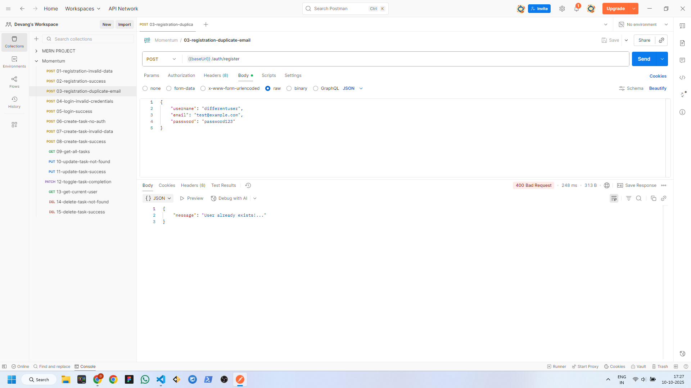

## 04 Login Invalid Credentials Request

```http
 POST {{baseUrl}}/auth/login
```

Body: 
```
{
    "email": "test@example.com",
    "password": "wrongpassword"
}
```

Expected Outcome:

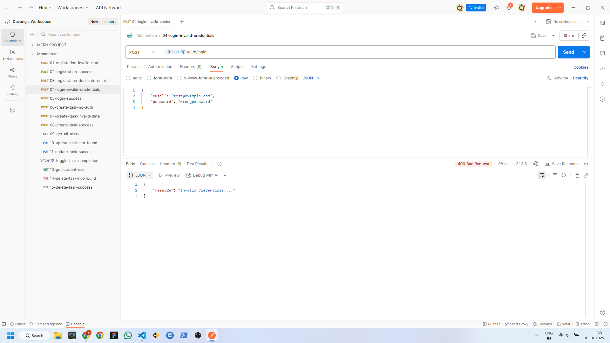

## 05 Login Success Request

```http
 POST {{baseUrl}}/auth/login
```

Body: 
```
{
    "email": "test@example.com",
    "password": "password123"
}
```

Expected Outcome:

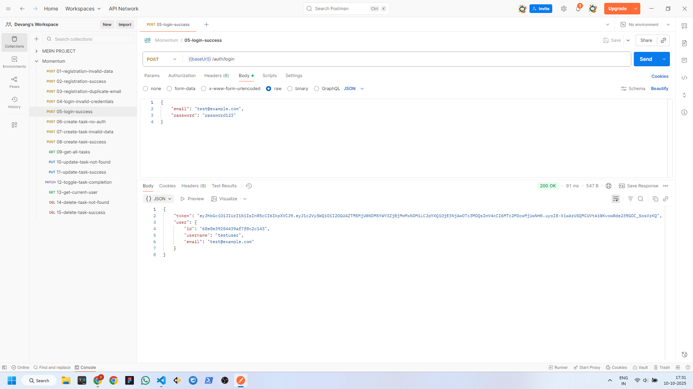

## 06 Create Task No Auth Request

```http
 POST {{baseUrl}}/tasks
```

Headers
```
Autharization: (leave empty)
```

Body: 
```
{
    "message": "Complete API testing documentation",
    "priority": "do-today",
    "deadline": "2024-12-31T23:59:00.000Z"
}
```

Expected Outcome:

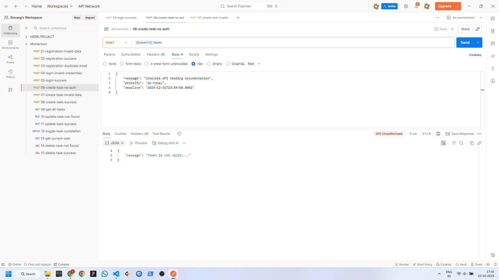

## 07 Create Task Invalid Data Request

```http
 POST {{baseUrl}}/tasks
```

**Headers:**
| Key | Value |
| :-- | :---- |
| Autharization | Bearer {{authToken}}|

**Body:**
```
{
    "message": "",
    "deadline": "invalid-date"
}
```

Expected Outcome:

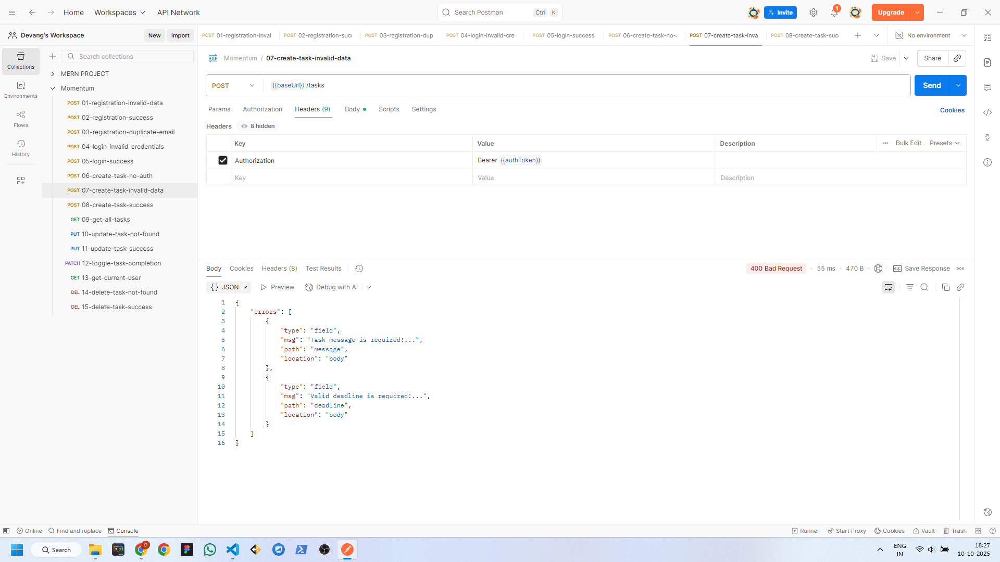

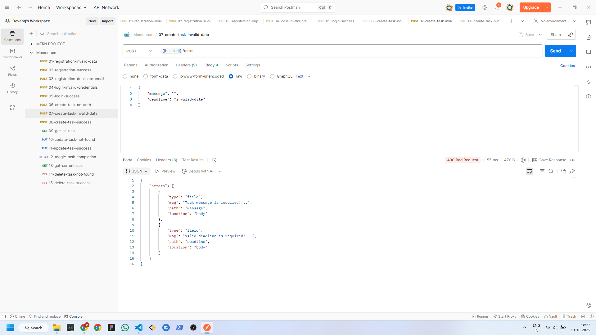

> IMPORTANT: Replace authToken value on every login/register request success. You will find the value in the response on success.

## 08 Create Task Success Request

```http
 POST {{baseUrl}}/tasks
```

**Headers:**
| Key | Value |
| :-- | :---- |
| Autharization | Bearer {{authToken}}|

**Body:**
```
{
    "message": "Complete API testing documentation",
    "priority": "do-today",
    "deadline": "2024-12-31T23:59:00.000Z"
}
```

Expected Outcome:

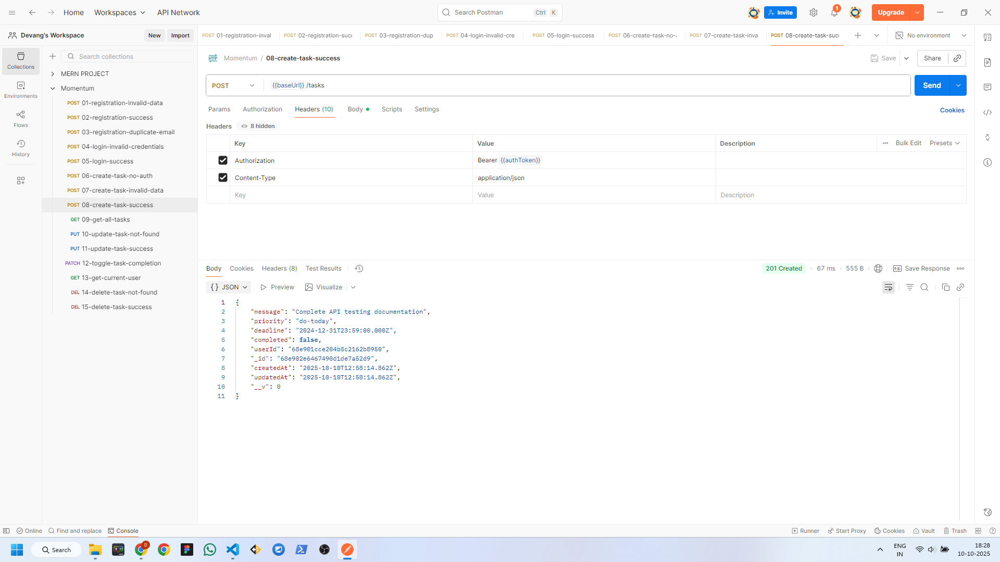

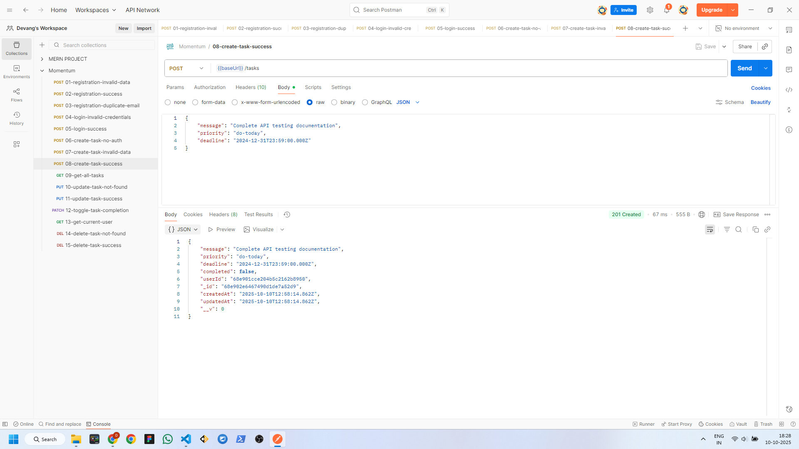

> IMPORTANT: Replace authToken value on every login/register request success. You will find the value in the response on success.

## 09 Get All Tasks Request

```http
 POST {{baseUrl}}/tasks
```

**Headers:**
| Key | Value |
| :-- | :---- |
| Autharization | Bearer {{authToken}}|

**Body:**
```
(leave empty)
```

Expected Outcome:

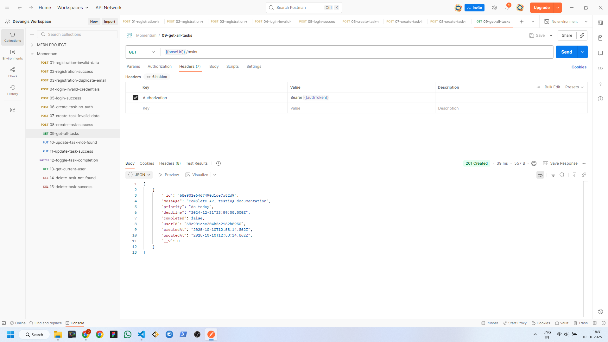

> IMPORTANT: Replace authToken value on every login/register request success. You will find the value in the response on success.

## 10 Update Task Not Found Request

```http
 PUT {{baseUrl}}/tasks/507f1f77bcf86cd799439011
```

**Headers:**
| Key | Value |
| :-- | :---- |
| Autharization | Bearer {{authToken}}|

**Body:**
```
{
    "message": "This task doesn't exist",
    "priority": "todo",
    "deadline": "2024-12-31T23:59:00.000Z"
}
```

Expected Outcome:

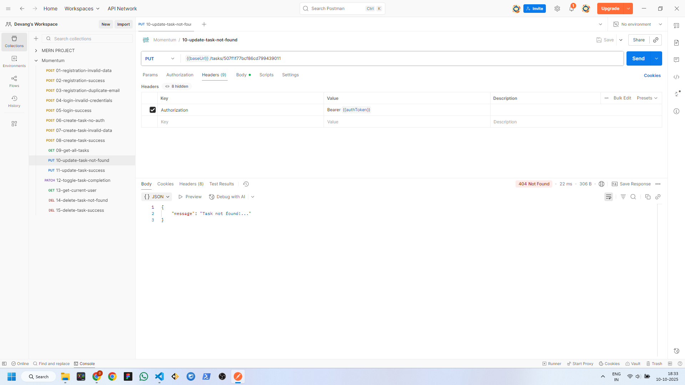

> IMPORTANT: Replace authToken value on every login/register success request. You will find the value in the response on success.

## 11 Update Task Success Request

```http
 PUT {{baseUrl}}/tasks/{{taskId}}
```

**Headers:**
| Key | Value |
| :-- | :---- |
| Autharization | Bearer {{authToken}}|

**Body:**
```
{
    "message": "Updated: Complete API testing documentation",
    "priority": "for-later",
    "deadline": "2025-01-15T23:59:00.000Z"
}
```

Expected Outcome:

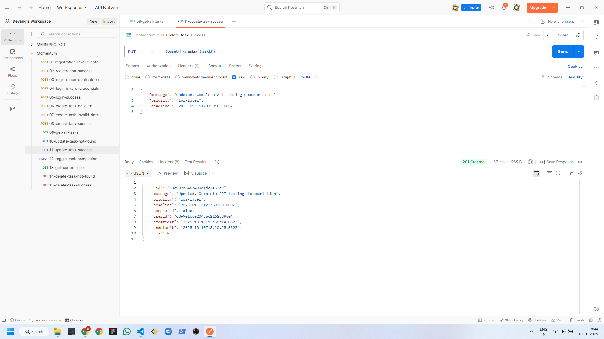

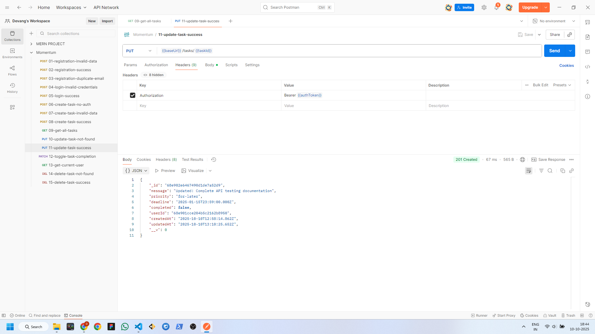

> IMPORTANT: 
> - Replace authToken value on every login/register success request. You will find the value in the response on success.
> - Make sure you add the taskId value to the url. You will find the value in the get all tasks success response panel.

## 12 Toggle Task Completion Request

```http
 PATCH {{baseUrl}}/tasks/{{taskId}}/toggle
```

**Headers:**
| Key | Value |
| :-- | :---- |
| Autharization | Bearer {{authToken}}|

**Body:**
```
(leave empty)
```

Expected Outcome:


> IMPORTANT: 
> - Replace authToken value on every login/register success request. You will find the value in the response on success.
> - Make sure you add the taskId value to the url. You will find the value in the get all tasks success response panel.

## 13 Get Current User Request

```http
 GET {{baseUrl}}/auth/me
```

**Headers:**
| Key | Value |
| :-- | :---- |
| Autharization | Bearer {{authToken}}|

**Body:**
```
(leave empty)
```

Expected Outcome:

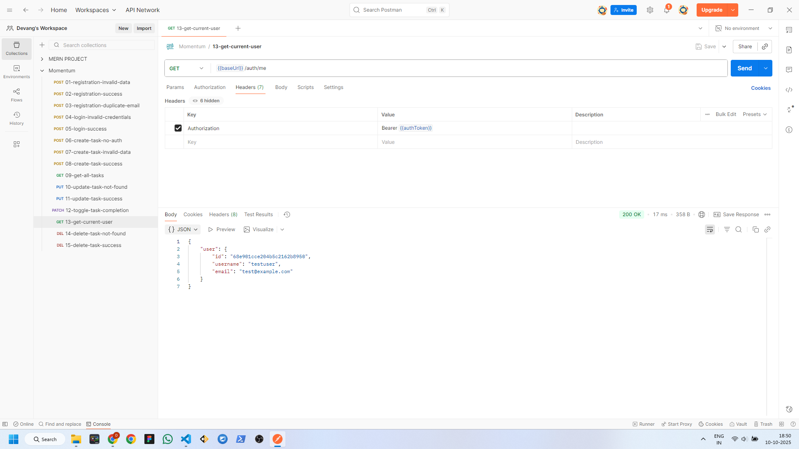

> IMPORTANT: Replace authToken value on every login/register success request. You will find the value in the response on success.

## 14 Delete Task Not Found Request

```http
 DELETE {{baseUrl}}/tasks/507f1f77bcf86cd799439011
```

**Headers:**
| Key | Value |
| :-- | :---- |
| Autharization | Bearer {{authToken}}|

**Body:**
```
(leave empty)
```

Expected Outcome:

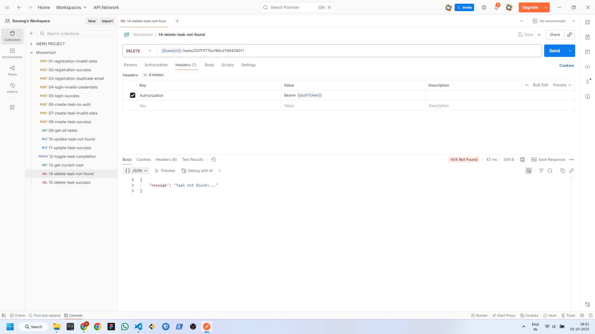

> IMPORTANT: Replace authToken value on every login/register success request. You will find the value in the response on success.

## 15 Delete Task Success Request

```http
 DELETE {{baseUrl}}/tasks/{{taskId}}
```

**Headers:**
| Key | Value |
| :-- | :---- |
| Autharization | Bearer {{authToken}}|

**Body:**
```
(leave empty)
```

Expected Outcome:

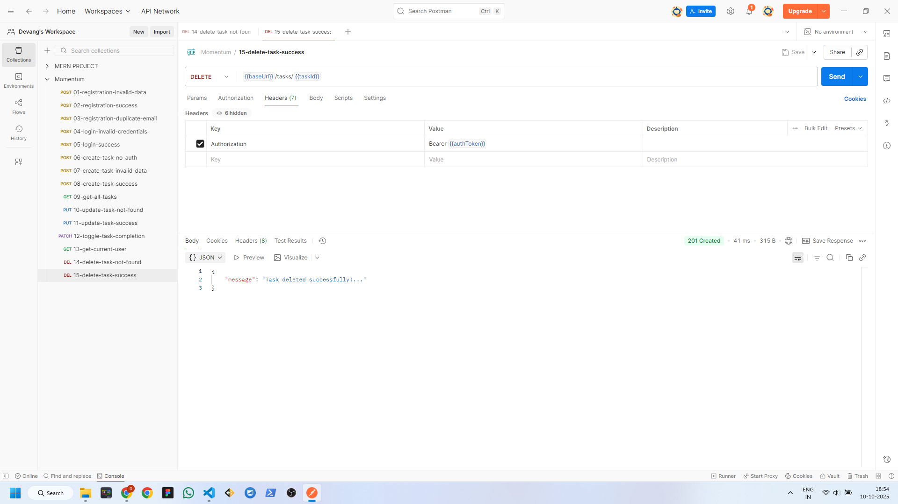

> IMPORTANT: 
> - Replace authToken value on every login/register success request. You will find the value in the response on success.
> - Make sure you add the taskId value to the url. You will find the value in the get all tasks success response panel.